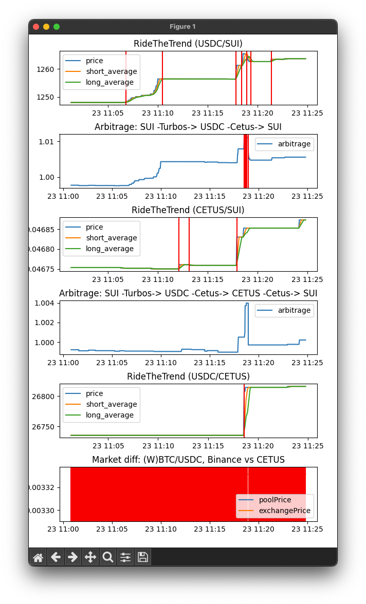

# capybot-monitor

## Overview
The Capybot Monitor is a collection of Python scripts to monitor the status of a running instance of a [Capybot trading bot](https://github.com/MystenLabs/capybot). It produces plots of the price development and key status indicators used by Capybot. The plots are updated live.

## Installation and Running
First download and install the Capybot trading bot as instructed in the [Capybot repository](https://github.com/MystenLabs/capybot). Run the Capybot and store the output to a file
```
npm run start > capybot.log
```
Now, first clone this repo. Run the `pools.py` script and give the path to the log file above as an argument, e.g.
```
python3 pools.py ../capybot/capybot.log
```
This should show a window showing the development of the amount of coin B you will get for fixed amount coin A relative to when the Capybot was started.


The `strategies.py` script is started in the same way but produces plots of relevant variables for the trading strategies the Capybot is using. A red vertical line shows that the given strategy gave a trade order at this point in time.


